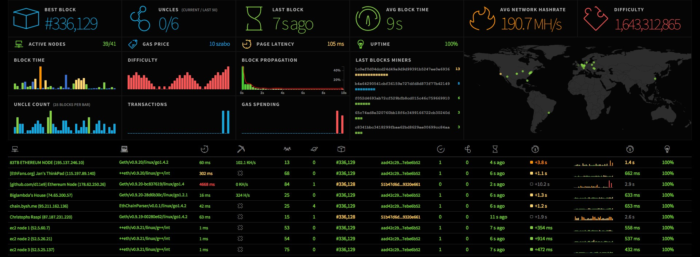

Ethereum Network Stats with POA and POW support
===============================================
[![Build Status][travis-image]][travis-url] [![dependency status][dep-image]][dep-url]

This is a visual interface for tracking proof-of-work ("mainnet") and proof-of-authority ("testnet") network status. It uses WebSockets to receive stats from running nodes and output them through an angular interface. It is the front-end implementation for [netstats-client](https://github.com/goerli/netstats-client).

## Proof-of-Authority


#### Prerequisite
* node
* npm

#### Installation
Make sure you have node.js and npm installed.

Clone the repository and install the dependencies:

```bash
git clone https://github.com/goerli/ethstats-server
cd ethstats-server
npm install
sudo npm install -g grunt-cli
```

#### Build
In order to build the static files you have to run grunt tasks which will generate dist directories containing the js and css files, fonts and images.

```bash
grunt poa
```

#### Run
Start a node process and pass the websocket secret to it.

```bash
WS_SECRET="asdf" npm start
```
Find the interface at http://localhost:3000

## Proof-of-Work (Legacy)



Same as above, just run the `pow` build task in Grunt.

```bash
grunt pow
WS_SECRET="asdf" npm start
```

:-)

[travis-image]: https://travis-ci.org/goerli/ethstats-server.svg
[travis-url]: https://travis-ci.org/goerli/ethstats-server
[dep-image]: https://david-dm.org/goerli/ethstats-server.svg
[dep-url]: https://david-dm.org/goerli/ethstats-server
